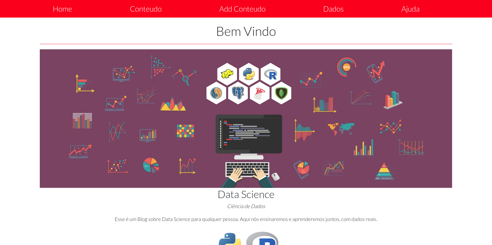
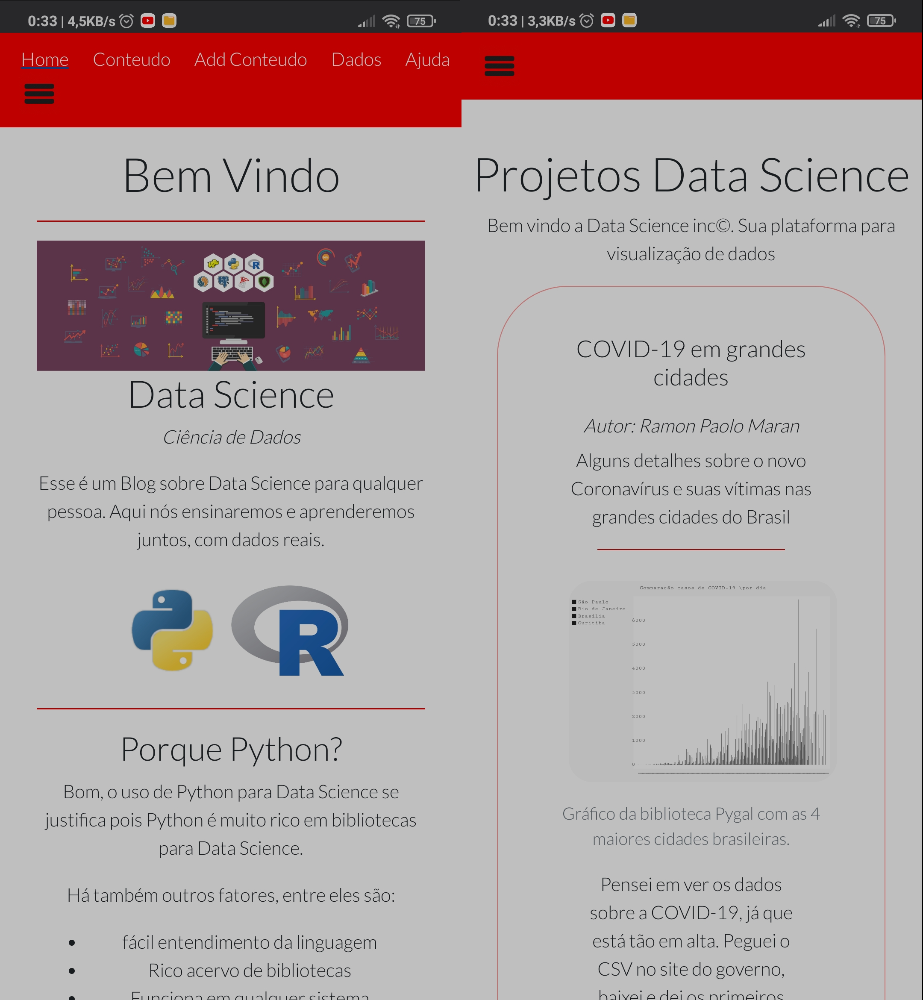

# Blog of Data Science about Python and R lenguages

 
 
 
 

 
 
 

# PrintScreen PWA

## Describe:

The site is focused for new programmers who want to have experience in Python and R to be able to apply in Data Science and Machine Learning.
The website uses real data released by government, non-profit institutions and third party data.

I used the React framework because it is a new technology in which I am studying and dedicating a lot of my time.

## Positives of use ReactJs:

- Single Page Aplication
- JavaScript and TypeScript lenguages
- Very utilized currently
- Reuse of codes

## Technologies useds:

## Front-end:

- HTML
- CSS
- JS
- JSX
- Bootstrap
- ReactJs

## Back-end:

- MySQL
- Node.Js
- Express
- Socket io

## IDE:

- Visual Studio Code
- Code-oss

## System:

- GNU/Linux Ubuntu 20.04 LTS
- Raspberry Pi 4 - Raspbian 32-Bits

## Cloning this repository:

        command: " git clone https://github.com/ramonpaolo/blog-data_science "
        and run the command: " npm start " in directory of project.

#### I hope see you helping me in this project :)

#### any problem, tell me: Ramonpaolomaran12@gmail.com

 
 

---

# Português - BR

## Descrição:

O site é focado para novos programadores que desejam ter experiência em Python e R para poder aplicar em Data Science e Machine Learning. 
O site utiliza dados reais divulgados pelo governo, instituições sem fins lucrativos e dados de terceiros.

Utilizei o framework React por ser uma nova tecnlogia no qual estou estudando e me dedicando muito de meu tempo. 

## Pontos positivos do uso do ReactJs:

- Single App Aplication
- JavaScript e TypeScript linguagens suportadas
- Muito utilizado Atualmente
- Reutilização de Códigos

## Tecnologias usadas:

## Front-end:

- HTML
- CSS
- JS
- JSX
- Bootstrap
- ReactJs

## Back-end:

- NoSQL (Mongo DB)
- Node.Js
- Express

## IDE:

- Visual Studio Code
- Code-oss

## Sistema:

- GNU/Linux Ubuntu 20.04 LTS
- Raspberry Pi 4 - Raspbian 32-Bits

## Clonando esse repositório:

        Clone o projeto com o comando: " git clone https://github.com/ramonpaolo/blog-data_science "
        e rode o comando: " npm start " logo enseguida no diretório do projeto raiz.

#### Eu espero ver você me ajudando nesse projeto :)

#### Qualquer problema, me conte: Ramonpaolomaran12@gmail.com

##### Autor: Ramon Paolo Maran
